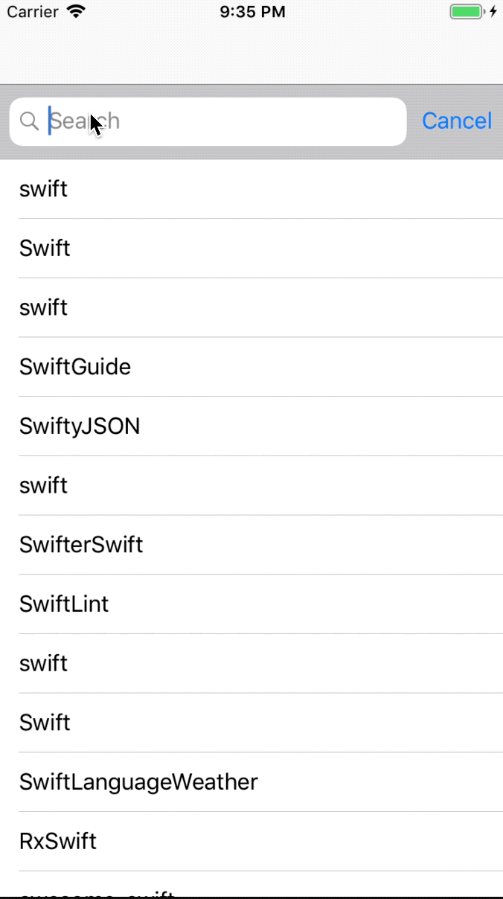

<h1 align="center">ios-architecture</h1>

👷 🧱 🧰 🛠️

<strong>Demystifying MVC, MVVM, VIPER, RIBs and many others</strong>

 A collection of simple one screen apps to showcase and discuss different architectural approaches in iOS

 

<!-- Last commit -->

<!-- Open issues -->

<!-- Swift version -->

<!-- Platform -->

<!-- License -->

Built with ❤︎ by
Pawel Krawiec

## Architectures
Examples are grouped in separate repository branches.

:star: Click the title of example to see detailed README information about specific architecture.

### Examples
| Example | Description |
| ------------- | ------------- |
| [mvvm-rxswift-pure](https://github.com/tailec/ios-architecture/tree/mvvm-rxswift-pure-observables) | Uses [RxSwift]() and observables as binding mechanism between `ViewController` and `ViewModel`. |
| [mvvm-rxswift-functions](https://github.com/tailec/ios-architecture/tree/mvvm-rxswift-subjects-observables) | Uses [RxSwift]() and observables as outputs from `ViewModel`. `ViewModel` inputs are defined as subjects wrapped in functions. |
| [mvvm-rxswift-subjects](https://github.com/tailec/ios-architecture/tree/mvvm-rxswift-subjects-observables) | Uses [RxSwift]() with observables as `ViewModel` outputs and subjects as `ViewModel` inputs. |

### Examples in progress
| Example | Description |
| ------------- | ------------- |
| mvc| In Progress |
| mvp| In Progress |
| mvvm-delegation | In Progress  |
| mvvm-closures | In Progress  |
| mvvm-reactive-swift | In Progress  |
| reswift | In Progress  |
| viper | In Progress  |
| viper-rxswift | In Progress  |
| ribs | In Progress  |

## Sample project

Most of the projects are simple one screen apps so you can understand crucial bits about given architecture (i.e. bindings between `ViewModel` and `ViewController` in MVVM examples).

However, some other architectures require more complexity (i.e. RIBs architecture) and the app may differ slightly.

The app is a simple list of repositories fetched from GitHub with a text field for querying new data.

The following GIF illustrates the UI of the app:

## Open in XCode
Clone the repository:

`git clone git@github.com:tailec/ios-architecture.git`

Checkout one of the branches:

`git checkout mvvm-rxswift-pure-observables`

Install pods:

`pod install`

**Note:**: Some of the examples don't use external libraries so `pod install` is not required.

**Note:** When switching branches, quit XCode first. It copies ignored `.xcworkspace` and `.xcproj` for some reason.

**Note:** Master branch contains only README file and it doesn't compile.

### Licence
MIT.
