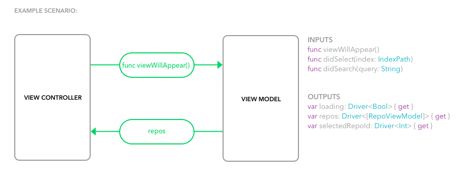

# mvvm-rxswift-functions-subjects-observables
This example uses RxSwift both observables and subjects as binding mechanism between `ViewModel` and `ViewController`.

## Implementation
The following image illustrates the bindings:

- `ViewModel` **inputs** such as text field changes or `UITableView` row selection are defined as swift functions which are simply wrappers for subjects in `ViewModel`
- `ViewModel` **outputs** are defined as `Driver` traits

## Installation
Clone the repository:

`git clone git@github.com:tailec/ios-architecture.git`

Checkout `mvvm-rxswift-functions-subjects-observables` branch:

`git checkout mvvm-rxswift-functions-subjects-observables`

Install dependencies:

 `pod install`
