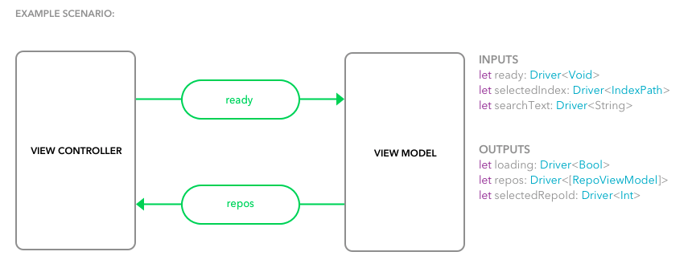

# mvvm-rxswift-pure-observables
This example uses RxSwift observables as binding mechanism between `ViewModel` and `ViewController`.


## Implementation
The following image illustrates the bindings:




- `ViewModel` **inputs** such as text field changes or `UITableView` row selection are defined as `Driver` traits
- `ViewModel` **outputs** are defined as `Driver` traits


`ViewModelType` is a simple scaffolding for every `ViewModel` in this architecture and it clearly defines inputs and outputs as structs.

```
protocol ViewModelType {
    associatedtype Input
    associatedtype Output

    func transform(input: Input) -> Output
}
```

Bindings are created when `ViewController` calls `func transform(input: Input) -> Output` function.


## Installation
Clone the repository:

`git clone git@github.com:tailec/ios-architecture.git`

Navigate to `mvvm-rxswift-pure` directory:

`cd mvvm-rxswift-pure`

Install dependencies:

 `pod install`
