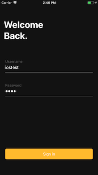
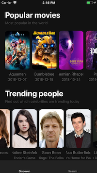
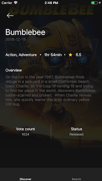
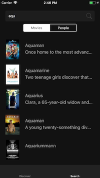

# tmdb-mvvm-rxswift-driver
🔒 ** If you want to login, use username `iostest` and password `test`.**

This example uses RxSwift Drivers as binding mechanism between `Driver` and `ViewController`.
### [Read Wiki](https://github.com/dmsl1805/Cookbook/wiki)

|  |  |
| --- | --- |
|  |  |

## Installation
Clone the repository:

`git clone git@github.com:tailec/ios-architecture.git`

Navigate to `tmdb-mvvm-pure` directory:

`cd tmdb-mvvm-pure`

Install dependencies:

 `pod install`
